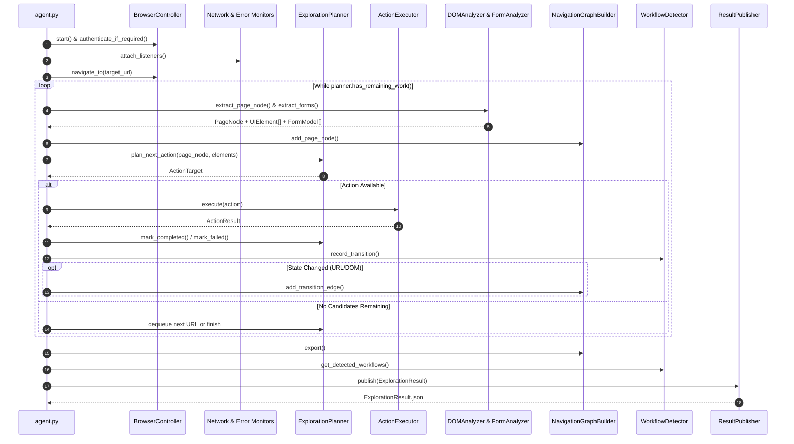

# ADIP Explorer Agent

The **Explorer Agent** is an autonomous, Playwright-driven exploration agent for the **Autonomous Demo Intelligence Platform (ADIP)**. It autonomously navigates target web applications like a curious human user—discovering pages, navigation menus, buttons, links, forms, tables, workflows, modal dialogs, network activity, visual layouts, and runtime errors.

It publishes structured, strongly-typed observations (`ExplorationResult.json`) without making business logic assumptions or generating final documentation, providing a clean ground truth for downstream platform agents.

---

## Architecture Overview

The Explorer Agent follows Clean Architecture and SOLID principles with complete decoupling between browser control, DOM parsing, state tracking, graph building, and result publishing.

```
ADIP/agents/explorer/
├── agent.py                  # Main coordinator orchestrating exploration loop
├── config.py                 # Pydantic environment & runtime configuration
├── prompts.py                # Prompt templates for vision/LLM extensions
├── interfaces.py             # Abstract Base Classes (ABCs) and Protocols
├── exceptions.py             # Custom exception hierarchy
├── sample_exploration_result.json  # Reference output JSON schema artifact
├── README.md
│
├── control/                  # Strategy, state management & publishing
│   ├── planner.py            # Exploration priority queue, backoff & loop prevention
│   ├── state.py              # State manager with JSON persistence/snapshots
│   └── publisher.py          # Serializes & exports ExplorationResult.json
│
├── browser/                  # Playwright browser interaction
│   ├── browser_controller.py # Browser launch, context, tabs, authentication
│   ├── action_executor.py    # Click, hover, scroll, type, upload, download
│   ├── recorder.py           # Screenshots (full-page, element, pre/post action)
│   └── network_monitor.py    # Subscribes to HTTP requests, responses & failures
│
├── analyzers/                # Page analysis & observation extraction
│   ├── dom_analyzer.py       # Extract UI elements, CSS selectors, XPaths, BoundingBoxes
│   ├── vision_analyzer.py    # Interface stub for future visual AI models
│   ├── form_analyzer.py      # Form inputs, labels, types, required fields, validation
│   ├── workflow_detector.py # End-to-end multi-step workflow sequence detection
│   ├── navigation_graph.py  # NetworkX directed graph builder (pages & edges)
│   ├── error_detector.py    # Console errors, 4xx/5xx HTTP, broken buttons, dialogs
│   └── metadata_extractor.py # Aggregates raw observations into ExplorationResult
│
├── models/                   # Strongly typed Pydantic models
│   ├── action.py             # ActionTarget, ActionResult, ActionType
│   ├── element.py            # UIElement, ElementType, BoundingBox
│   ├── error.py              # ErrorRecord, ErrorType
│   ├── exploration_result.py # ExplorationResult root container & ExplorationSummary
│   ├── form.py               # FormModel, FormField, FieldType
│   ├── navigation.py         # NavigationEdge, NavigationGraphExport
│   ├── network.py            # NetworkRequest, NetworkResponse
│   ├── page.py               # PageNode, PageMetadata
│   ├── screenshot.py         # ScreenshotRecord, ScreenshotType
│   └── workflow.py           # WorkflowStep, WorkflowSequence
│
├── utils/
│   ├── constants.py          # Viewport, timeout, tag set constants
│   ├── helpers.py            # URL normalization, hash computation, filename sanitization
│   └── logger.py             # Structured loguru logging setup
│
└── tests/                    # Unit test suite
    ├── test_agent.py
    ├── test_planner.py
    ├── test_browser.py
    ├── test_analyzers.py
    └── test_models.py
```

---

## Execution Flow



---

## Data Models Summary

All data passing between components uses strongly-typed Pydantic v2 models:

- **`PageNode`**: Represents a URL/state node, containing extracted elements, counts, titles, and metadata.
- **`UIElement`**: Detailed interactive DOM element (button, link, input, table, card, dialog) with CSS selector, XPath, visibility status, enabled status, and pixel viewport `BoundingBox`.
- **`FormModel` & `FormField`**: Structure of forms, input types (text, email, password, file, date, select), required flags, and captured validation messages.
- **`NavigationEdge` & `NavigationGraphExport`**: Serialized `NetworkX` directed graph topology (`nodes`, `edges`, weights).
- **`WorkflowSequence` & `WorkflowStep`**: Sequences of user actions across screens (e.g. Dashboard -> Projects -> Create Project -> Save).
- **`ActionResult`**: Detailed result of a browser action, execution time in ms, pre/post URLs, and state change boolean.
- **`ScreenshotRecord`**: Full-page, element, pre/post action, or error screenshot metadata.
- **`ErrorRecord`**: Captured HTTP 4xx/5xx errors, console stack traces, broken buttons, and dialog occurrences.
- **`NetworkRequest`**: Captured HTTP method, resource type, status code, latency, payload, and failure reasons.
- **`ExplorationResult`**: Aggregated single output object published to `ExplorationResult.json`.

---

## Installation & Setup

1. Ensure **Python 3.12+** is installed.
2. Install dependencies:
   ```bash
   pip install -r requirements.txt
   ```
3. Install Playwright browser binaries:
   ```bash
   playwright install chromium
   ```

---

## Configuration

Set options via environment variables (`ADIP_EXPLORER_*`) or pass an `ExplorerConfig` instance directly:

```python
from agents.explorer.config import ExplorerConfig

config = ExplorerConfig(
    target_url="http://localhost:3000",
    headless=True,
    browser_type="chromium",
    max_depth=3,
    max_actions=50,
    navigation_timeout_ms=10000,
    username="demo_user",
    password="SecretPassword123",
    output_dir="./exploration_output"
)
```

---

## Running the Explorer Agent

### CLI Execution

```bash
python -m agents.explorer.agent https://your-app.com
```

### Programmatic Usage

```python
import asyncio
from agents.explorer import ExplorerAgent, ExplorerConfig

async def run():
    config = ExplorerConfig(
        target_url="https://example.com",
        headless=True,
        max_actions=30
    )
    agent = ExplorerAgent(config)
    result = await agent.explore()
    print(f"Exploration completed: {result.summary.total_pages_discovered} pages found.")

if __name__ == "__main__":
    asyncio.run(run())
```

---

## Running Tests

Execute the unit test suite using `pytest`:

```bash
pytest agents/explorer/tests/ -v
```

---

## Downstream Agent Consumption Guide

The Explorer Agent produces `ExplorationResult.json`. Here is how future ADIP agents consume this artifact:

1. **Knowledge Graph Agent**:
   - Consumes `navigation_graph` (`nodes`, `edges`) and `pages` to build the application graph database schema in Neo4j/PostgreSQL.
   - Maps UI components (`elements`, `forms`) as sub-nodes attached to Page nodes.

2. **Documentation Agent**:
   - Reads `workflows` to generate step-by-step User Manuals and Feature Guides.
   - Uses `forms` and `elements` to write API and UI Field Specifications.
   - Embeds `screenshots` associated with each page node and workflow step.

3. **Demo Agent**:
   - Consumes `workflows` and `screenshots` to produce animated product demo walk-throughs and automated demo video scripts.
   - Uses `BoundingBox` coordinates and action timing (`execution_time_ms`) to simulate smooth cursor movements.

4. **QA Agent**:
   - Translates `workflows` into automated E2E test suites (Playwright / Cypress).
   - Inspects `errors` to flag broken paths, unhandled console exceptions, or HTTP 500 responses.
   - Uses `forms` metadata (`is_required`, `field_type`) to generate negative boundary testing matrices.

5. **Release Intelligence Agent**:
   - Diff-compares `ExplorationResult.json` from consecutive build releases to generate Automated Release Notes, UI delta reports, and breaking change alerts.
