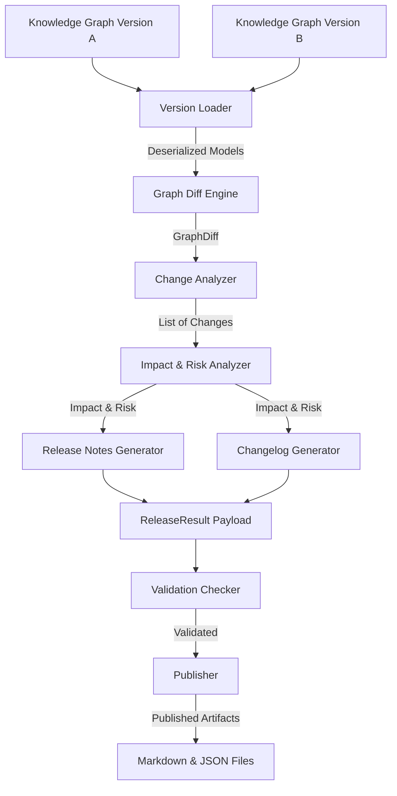

# Release Intelligence Agent

The **Release Intelligence Agent** is an independent, standalone agent within the **Autonomous Demo Intelligence Platform (ADIP)** architecture. Located under `ADIP/agents/release_intelligence/`, it autonomously compares two versioned Product Knowledge Graphs, detects structural differences deterministically, evaluates multi-dimensional AI business & technical impact, formats audience-specific release notes and changelogs, validates outputs, and packages published release intelligence artifacts.

---

## 🌟 Key Architecture Principles

1. **Standalone Microservice Design**: Fully encapsulated inside `ADIP/agents/release_intelligence/`. Contains its own models, configuration, loaders, diff engines, prompt templates, utilities, and test suites.
2. **Deterministic Diffing**: Uses graph topology matching (NetworkX) and structural deltas to calculate differences without LLM halluncination.
3. **AI-Powered Impact Analysis**: Uses LLM reasoning (with heuristic fallback engine) to deduce user impact, developer impact, documentation updates, QA recommendations, demo flow updates, breaking changes, and risk scores.
4. **Multi-Audience Release Notes**: Generates tailored notes for **Customer**, **Internal Engineering**, **Executive Briefing**, and **Technical Integrators**.
5. **Multi-Format Changelogs**: Produces **Markdown**, **JSON**, **Plain Text**, and **HTML** changelogs.
6. **Strict Validation & Extension Hooks**: Validates completeness and metadata before publishing artifacts to disk, with pluggable interfaces for GitHub Releases, Notion, Confluence, and Event Bus.

---

## 📁 Repository & File Structure

```
ADIP/agents/release_intelligence/
├── agent.py                        # Master Orchestrator Agent (ReleaseIntelligenceAgent)
├── config.py                       # Configuration settings (ReleaseIntelligenceConfig)
├── prompts.py                      # Prompt template re-exports
├── interfaces.py                   # Component ABC Interfaces
├── exceptions.py                   # Custom Exception Hierarchy
├── sample_release_result.json      # Sample serialized master ReleaseResult
├── README.md                       # Architecture & Integration Guide
│
├── loaders/
│   ├── __init__.py
│   └── version_loader.py           # Loads & deserializes versioned Knowledge Graphs
│
├── comparison/
│   ├── __init__.py
│   ├── comparator.py               # Granular page, workflow, form, API comparators
│   ├── diff_engine.py              # Deterministic GraphDiff engine (NetworkX)
│   └── change_analyzer.py          # Categorizes deltas into structured Change objects
│
├── prompts/
│   ├── __init__.py
│   ├── release_notes_prompt.py     # Customer, Engineering, Executive, Technical prompts
│   ├── impact_analysis_prompt.py   # Multi-dimensional impact prompt
│   ├── breaking_changes_prompt.py  # Breaking changes prompt
│   ├── customer_summary_prompt.py  # Customer summary prompt
│   ├── developer_summary_prompt.py # Developer impact prompt
│   └── risk_analysis_prompt.py     # Release risk assessment prompt
│
├── intelligence/
│   ├── __init__.py
│   ├── impact_analyzer.py          # AI Impact & Risk Assessor (LLM + Fallback)
│   ├── release_notes_generator.py  # Multi-audience Release Notes Generator
│   └── changelog_generator.py      # Multi-format Changelog Generator
│
├── publishing/
│   ├── __init__.py
│   ├── validation_checker.py       # Quality & consistency validation engine
│   └── publisher.py                # Disk publishing & external integration stubs
│
├── models/
│   ├── __init__.py
│   ├── knowledge_graph.py          # Knowledge Graph entity Pydantic models
│   ├── graph_diff.py               # GraphDiff & EntityDelta models
│   ├── change.py                   # Categorized Change & Component models
│   ├── impact.py                   # UserImpact, DeveloperImpact, Recommendations
│   ├── release_note.py             # ReleaseNote & MultiAudienceReleaseNotes
│   ├── changelog.py                # Changelog & ChangelogSection models
│   ├── risk_assessment.py          # RiskAssessment, BreakingChange, RiskFactor
│   ├── release_summary.py          # FeatureSummary & ExecutiveSummary
│   └── release_result.py           # Master ReleaseResult Pydantic payload
│
├── utils/
│   ├── __init__.py
│   ├── constants.py                # System enums & constants
│   ├── helpers.py                  # Text sanitization & dictionary diff helpers
│   └── logger.py                   # Loguru logger setup
│
└── tests/
    ├── __init__.py
    ├── test_version_loader.py      # Loader unit tests
    ├── test_diff_engine.py         # Diff engine unit tests
    ├── test_change_analyzer.py     # Change analyzer unit tests
    ├── test_impact_analyzer.py     # Impact analyzer unit tests
    ├── test_generators.py          # Generator unit tests
    ├── test_validation_and_publishing.py
    └── test_agent.py               # Full pipeline integration tests
```

---

## 🔄 Agent Execution Flow



---

## 🚀 Quickstart & Usage

### 1. Programmatic Execution

```python
import asyncio
from agents.release_intelligence import ReleaseIntelligenceAgent
from agents.release_intelligence.models import KnowledgeGraphVersion, PageNode

v1 = KnowledgeGraphVersion(
    version_id="1.0.0",
    pages=[PageNode(id="p1", title="Login Page", url_path="/login")]
)

v2 = KnowledgeGraphVersion(
    version_id="2.0.0",
    pages=[
        PageNode(id="p1", title="Login Page", url_path="/login"),
        PageNode(id="p2", title="Analytics Dashboard", url_path="/analytics")
    ]
)

async def main():
    agent = ReleaseIntelligenceAgent()
    result = await agent.run(v1, v2)
    
    print(f"Release ID: {result.release_id}")
    print(f"Total Changes: {result.release_summary.total_changes}")
    print(f"Risk Score: {result.risk_assessment.risk_score}/10.0 ({result.risk_assessment.overall_risk_level})")

asyncio.run(main())
```

### 2. Running Unit & Integration Tests

Execute the full unit test suite:
```powershell
python -m unittest discover -s agents/release_intelligence/tests
```

---

## ⚙️ Configuration Settings

Configure via environment variables (`RELEASE_INTEL_*`) or `ReleaseIntelligenceConfig`:

| Setting | Type | Default | Description |
| :--- | :--- | :--- | :--- |
| `agent_name` | `str` | `"Release Intelligence Agent"` | Agent identifier |
| `output_dir` | `Path` | `artifacts/release_intelligence` | Directory where output files are saved |
| `llm_provider` | `str` | `"mock"` | `"openai"`, `"gemini"`, `"anthropic"`, or `"mock"` |
| `api_key` | `Optional[str]` | `None` | API key for LLM reasoning |
| `model_name` | `str` | `"gpt-4o"` | LLM model identifier |
| `strict_validation`| `bool` | `True` | Raise exception if release validation fails |
| `auto_publish` | `bool` | `True` | Automatically write outputs to disk |

---

## 🔌 Integration with ADIP Multi-Agent Platform

The Release Intelligence Agent is designed with decoupled, publishable outputs so other ADIP platform agents consume its `ReleaseResult` payload without tight coupling:

- **Documentation Agent**: Consumes `impact_analysis.doc_recommendations` to automatically trigger documentation updates.
- **QA Agent**: Consumes `impact_analysis.qa_recommendations` and `risk_assessment.breaking_changes` to regenerate regression test suites.
- **Demo Agent**: Consumes `impact_analysis.demo_recommendations` to update automated sales demo recording scripts.
- **Orchestrator Agent**: Receives `ReleaseResult` via `Publisher.publish_to_event_bus()` to coordinate downstream workflows.
