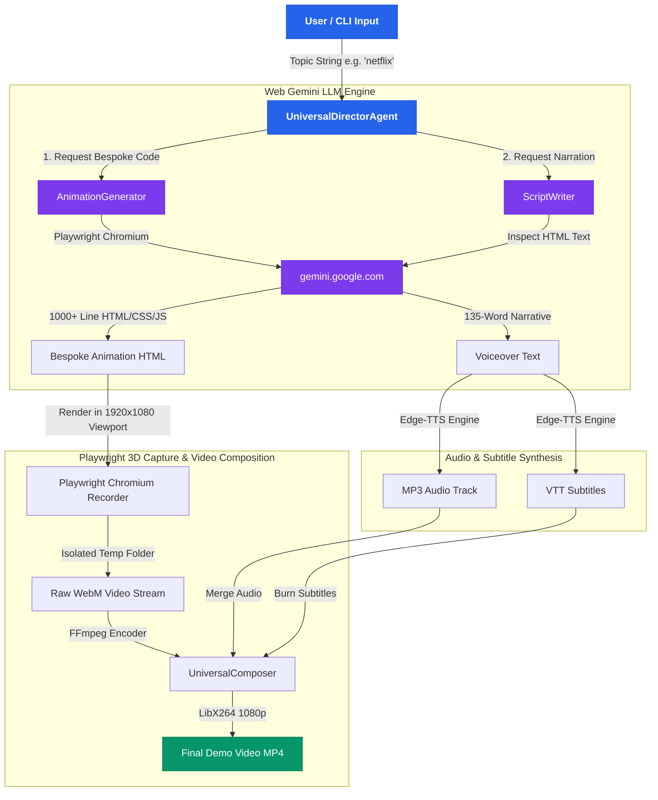

# Knowledge Graph & System Architecture — Universal Director Agent

## System Component Knowledge Graph

### 1. Orchestration Node (`agents/universal_director/agent.py`)
- **Role**: Central controller managing the 4-phase video synthesis pipeline.
- **Inputs**: Topic string (e.g. `"creator economy"`, `"netflix"`, `"apple siri"`, `"space fitness"`).
- **Outputs**: Path to compiled 1080p MP4 product demo video.

### 2. Bespoke Code Generator (`agents/universal_director/animation_generator.py`)
- **Role**: Prompts Web Gemini via automated visible Chromium browser to invent a unique UI, 3D perspective layout, SVG animations, glassmorphic floating bubbles, and auto-advancing JS timeline.
- **Key Characteristics**: Zero static templates; generates up to 1000+ lines of custom HTML/CSS/JS per topic.

### 3. Synchronized Script Writer (`agents/universal_director/script_writer.py`)
- **Role**: Reads the generated HTML text and prompts Web Gemini for a high-energy 130-140 word narration.
- **Alignment**: Aligns narrative pacing to match the 45-second visual animation timeline.

### 4. Speech & Subtitle Engine (`edge_tts`)
- **Role**: Converts narrative text to broadcast-quality audio (`.mp3`) and timed subtitles (`.vtt`).

### 5. Playwright & FFmpeg Composer (`agents/universal_director/composer.py`)
- **Role**: Records the auto-advancing 3D HTML animation in an isolated recording directory (`temp_rec_<topic>`), merges audio, burns subtitles, and outputs the final `.mp4`.
