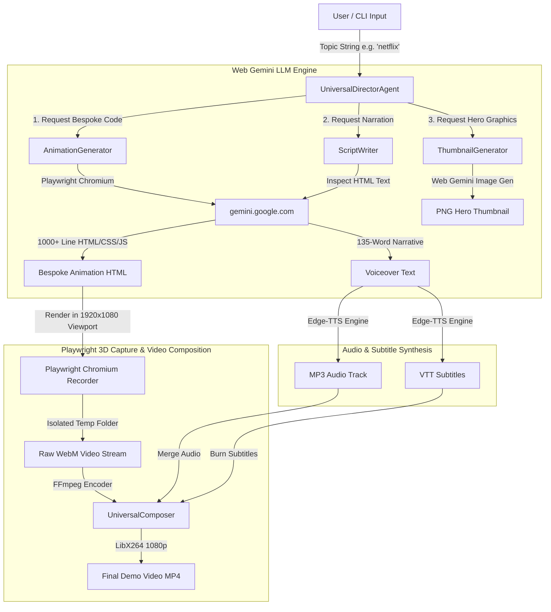

# 🎬 Universal Director — Fully Autonomous AI Video & Thumbnail Generator

> **Democritic Intelligence**: An autonomous, fully LLM-driven video synthesis pipeline that transforms any text topic into a broadcast-quality 1080p product demo video and cinematic thumbnail — **without requiring paid API keys**.

---

## 🌟 Key Features

- **Zero API Key Requirement**: Uses automated Playwright Chromium browser sessions connected to Web Gemini (`gemini.google.com`).
- **Generative Motion Engineering**: Automatically writes bespoke 1000+ line HTML/CSS/JS animations with 3D glassmorphism, dynamic gradients, pop-out cards, and auto-advancing scene timelines.
- **Context-Aware Voiceover Scripts**: Reads generated HTML text and prompts Web Gemini for high-energy 130–140 word narration scripts.
- **Professional Speech & Subtitle Engine**: Converts script text into crystal-clear MP3 audio narration and synced `.vtt` subtitles using `edge-tts`.
- **Dynamic 1080p Video Composition**: Renders animations at 60FPS in a 1920x1080 viewport using Playwright, merging audio and burning subtitles via FFmpeg.
- **AI Thumbnail Generation**: Prompts Web Gemini to produce 16:9 cinematic product launch hero images for every topic, with automatic fallback screenshotting.

---

## 🏗️ System Architecture & Workflow



---

## ⚙️ Prerequisites

1. **Python**: 3.10 or higher
2. **FFmpeg**: Must be installed and available in system `PATH`.
3. **Google Chrome / Chromium**: Installed via Playwright.

---

## 🚀 Quickstart & Installation

```bash
# 1. Clone the repository
git clone https://github.com/8428215330a-ui/Incident-Time-Machine.git
cd Incident-Time-Machine

# 2. Install Python dependencies
pip install -r requirements.txt

# 3. Install Playwright browser binaries
playwright install chromium
```

---

## 📖 Usage

### Generate a Single Video
Run the interactive CLI command with any topic:

```bash
python run_universal.py "space exploration"
```

Or pass topics directly:
```bash
python run_universal.py "netflix media streaming"
python run_universal.py "cyberpunk crypto"
python run_universal.py "apple siri hardware"
```

### Run the Automated Test Suite
To verify the full generation pipeline across multiple topics:

```bash
python test_suite.py
```

---

## 📁 Repository Structure

```
.
├── agents/
│   ├── demo/
│   │   └── gemini_web_llm.py     # Playwright Web Gemini LLM Automation
│   └── universal_director/
│       ├── agent.py               # Master Pipeline Orchestrator
│       ├── animation_generator.py # Generative Motion HTML Code Engine
│       ├── script_writer.py       # Synchronized Narration Generator
│       ├── thumbnail_generator.py # AI Product Thumbnail Generator
│       └── composer.py            # Playwright Capture & FFmpeg Encoder
├── animation/                     # Generated HTML/CSS/JS animations
├── run_universal.py               # Main CLI Execution Entrypoint
├── test_suite.py                  # Automated Pipeline Test Suite
├── KNOWLEDGE_GRAPH.md             # In-depth Architectural Specification
├── requirements.txt               # Python Dependencies
└── README.md                      # Project Documentation
```

---

## 📝 License

Distributed under the MIT License.
