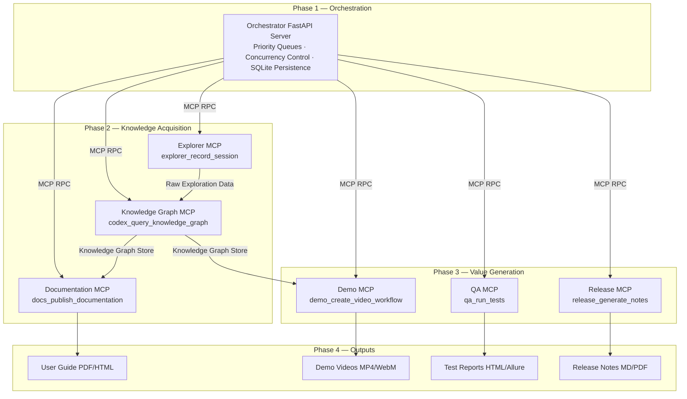

<div align="center">

# 🤖 ADIP — Autonomous Product Intelligence Platform

**An enterprise-grade, multi-agent AI system built on the Model Context Protocol (MCP)**

[](https://www.python.org/)
[](https://www.typescriptlang.org/)
[](https://fastapi.tiangolo.com/)
[](https://github.com/jlowin/fastmcp)
[](https://nodejs.org/)

> Transform any application into a fully documented, quality-tested, and demo-ready product — **autonomously**.

[Quick Start](#-quick-start) · [Architecture](#-architecture) · [Agents](#-agent-descriptions) · [Configuration](#-configuration) · [API Reference](#-api-reference)

</div>

---

## 📋 Table of Contents

- [Overview](#-overview)
- [Architecture](#-architecture)
- [Repository Structure](#-repository-structure)
- [Agent Descriptions](#-agent-descriptions)
- [Tech Stack](#-tech-stack)
- [Prerequisites](#-prerequisites)
- [Quick Start](#-quick-start)
- [Configuration](#-configuration)
- [API Reference](#-api-reference)
- [democriticIntelligence Module](#-democraticintelligence-module)
- [Contributors](#-contributors)

---

## 🌟 Overview

The **Autonomous Product Intelligence Platform (ADIP)** is an enterprise-grade, microservice-based AI pipeline that autonomously:

- 🔍 **Explores** any web application via headless browser automation
- 🧠 **Constructs** a structured knowledge graph of entities, relationships, and UI flows
- 📄 **Generates** comprehensive user guides, admin documentation, and FAQs
- 🧪 **Runs** automated smoke tests, regression tests, and produces test reports
- 🎬 **Produces** professional demo videos with 3D WebGL animations, AI voiceover, and synced subtitles
- 📦 **Tracks** version changes and auto-generates release notes and change summaries

The monolithic agent system has been decomposed into **7 independent MCP microservices** governed by a **centralized FastAPI Orchestrator**, enabling horizontal scaling, overload protection, and fault isolation.

---

## 🏗️ Architecture

The ADIP pipeline is structured in four phases, orchestrated by a central coordinator that delegates work to specialized MCP servers via the **Model Context Protocol (MCP) RPC**.

### System Architecture Diagram


### Communication Flow



### Orchestrator — Overload Protection Architecture

The Orchestrator is engineered for production resilience:

| Feature | Detail |
|---|---|
| **Priority Queue** | Unlimited depth, priority-based job scheduling |
| **Concurrency Limits** | Explorer: 5 · Knowledge: 10 · Docs: 10 · QA: 4 · Demo: 2 · Release: 5 |
| **Persistence** | SQLite-backed job state with auto-recovery on restart |
| **Worker Pool** | Multi-user, non-blocking agent worker pools |
| **Scheduler** | Continuous resource and queue management scheduler |

---

## 📁 Repository Structure

```text
ADIP-agent/
│
├── build.js                   # Setup: downloads uv, creates Python venv, installs deps
├── start.js                   # Entry point: launches FastAPI orchestrator via Node.js
├── package.json               # Node scripts: build & start
├── .gitignore
│
├── orchestrator/              # Central FastAPI server (Python)
│   ├── main.py                # FastAPI app, /workflows endpoint, dashboard HTML
│   ├── requirements.txt       # fastapi, uvicorn, pydantic, mcp
│   └── agents/orchestrator/
│       ├── agent.py           # OrchestratorAgent: router, planner, registry, job manager
│       ├── router.py          # RequestRouter: routes goals to appropriate agents
│       ├── planner.py         # WorkflowPlanner: decomposes goals into task graphs
│       ├── registry.py        # AgentRegistry: tracks available MCP servers
│       ├── job_manager.py     # JobManager: CRUD for workflow/job state
│       ├── concurrency.py     # ConcurrencyController: per-agent semaphores
│       ├── queues.py          # QueueManager: priority queues
│       ├── persistence.py     # DatabaseManager: SQLite adapter
│       ├── worker_pool.py     # AgentWorkerPool: async worker dispatch
│       └── scheduler.py       # Continuous scheduling loop
│
├── explorer-mcp/              # Browser exploration MCP server
│   ├── server.py              # FastMCP("ExplorerAgent Server")
│   ├── tools.py               # explorer_record_session(target_url, headless)
│   └── requirements.txt
│
├── knowledge-mcp/             # Knowledge graph MCP server
│   ├── server.py              # FastMCP("KnowledgeGraphAgent Server")
│   ├── tools.py               # codex_query_knowledge_graph(query)
│   └── requirements.txt
│
├── documentation-mcp/         # Documentation generation MCP server
│   ├── server.py              # FastMCP("DocumentationAgent Server")
│   ├── tools.py               # docs_publish_documentation(title, category)
│   └── requirements.txt
│
├── qa-mcp/                    # QA testing MCP server
│   ├── server.py              # FastMCP("QAAgent Server")
│   ├── tools.py               # qa_run_tests(target_app, test_types)
│   └── requirements.txt
│
├── demo-mcp/                  # Demo video generation MCP server
│   ├── server.py              # FastMCP("DemoAgent Server")
│   ├── tools.py               # demo_create_video_workflow(title, app_name, render_3d)
│   └── requirements.txt
│
├── release-mcp/               # Release intelligence MCP server
│   ├── server.py              # FastMCP("ReleaseIntelligenceAgent Server")
│   ├── tools.py               # release_generate_notes(version, release_type)
│   └── requirements.txt
│
├── shared/                    # Unified MCP tool registry (all agents in one server)
│   └── mcp_agent_server.py    # FastMCP server exposing all agent tools
│
└── democriticIntelligence/    # Standalone AI video & thumbnail generator module
    └── README.md              # Full docs for the Universal Director system
```

---

## 🤖 Agent Descriptions

### 1. 🧠 Orchestrator Agent

**Role:** Central command and planning hub.

- Accepts workflow goals via REST API (`POST /workflows`)
- Decomposes goals into ordered task graphs using `WorkflowPlanner`
- Routes tasks to appropriate MCP servers via `RequestRouter`
- Monitors progress, manages concurrency, and persists state in SQLite
- Serves a web dashboard UI at `GET /`

> **Concurrency:** Priority queue · Unlimited depth · Multi-user worker pools

---

### 2. 🔍 Explorer Agent (`explorer-mcp`)

**Role:** Captures raw exploration data from any web application.

- Launches headless Playwright/Chromium browser sessions
- Records user flows, captures screenshots, logs DOM events
- Extracts metadata (page titles, element types, navigation paths)
- Outputs raw exploration data: screens, logs, and events

**Tool signature:**
```python
explorer_record_session(target_url: str, headless: bool = True) -> str
```

---

### 3. 🧩 Knowledge Graph Agent (`knowledge-mcp`)

**Role:** Transforms raw exploration data into a structured knowledge store.

- Builds entity-relationship graphs from exploration sessions
- Links screens, actions, and data into nodes and edges
- Stores embeddings for semantic search and memory retrieval
- Feeds downstream agents (Documentation, Demo) with structured context

**Tool signature:**
```python
codex_query_knowledge_graph(query: str) -> str
```

---

### 4. 📄 Documentation Agent (`documentation-mcp`)

**Role:** Generates professional documentation from the knowledge graph.

- Creates User Guides, Admin Guides, and FAQ documents
- Outputs to PDF and HTML formats
- Keeps documentation synchronized with application changes

**Tool signature:**
```python
docs_publish_documentation(title: str, category: str = "guide") -> str
```

---

### 5. 🧪 QA Agent (`qa-mcp`)

**Role:** Automated quality assurance and test execution.

- Runs Playwright-powered smoke tests and regression tests
- Generates Allure/HTML test reports with screenshots
- Surfaces regressions and failure traces

**Tool signature:**
```python
qa_run_tests(target_app: str, test_types: str = "smoke,regression") -> str
```

---

### 6. 🎬 Demo Agent (`demo-mcp`)

**Role:** Produces broadcast-quality demo showcase videos.

- Generates bespoke 1000+ line HTML/CSS/JS 3D WebGL animations
- Renders at 60FPS in 1920x1080 viewport via Playwright
- Produces AI voiceover narration (MP3) and synced `.vtt` subtitles via `edge-tts`
- Merges audio, video, and subtitles via FFmpeg into final MP4

**Tool signature:**
```python
demo_create_video_workflow(workflow_title: str, app_name: str = "Amazon", render_3d: bool = True) -> str
```

---

### 7. 📦 Release Intelligence Agent (`release-mcp`)

**Role:** Tracks version changes and generates release artifacts.

- Diffs versions to detect added, modified, and removed features
- Generates structured release notes (Markdown/PDF)
- Produces executive-level change summaries for stakeholders

**Tool signature:**
```python
release_generate_notes(version: str, release_type: str = "minor") -> str
```

---

## 🛠️ Tech Stack

| Layer | Technologies |
|---|---|
| **Orchestrator** | Python 3.11, FastAPI, Uvicorn, Pydantic, SQLite |
| **MCP Servers** | Python 3.11, FastMCP (`mcp.server.fastmcp`) |
| **Browser Automation** | Playwright, Chromium (headless) |
| **Video Pipeline** | FFmpeg, edge-tts, Playwright screen recording |
| **AI / LLM** | Web Gemini (`gemini.google.com`) via Playwright — no API key required |
| **Animation** | Bespoke HTML/CSS/JS · 3D WebGL · Glassmorphism effects |
| **Build System** | Node.js, `uv` (Astral Python package manager) |
| **Languages** | Python 69% · TypeScript 15% · HTML 13% · JavaScript 3% |

---

## 📋 Prerequisites

| Tool | Version | Purpose |
|---|---|---|
| **Node.js** | >= 18.x | Build & start scripts |
| **Python** | >= 3.11 | All MCP servers and orchestrator |
| **FFmpeg** | Latest | Video composition in Demo Agent |
| **Git** | Latest | Cloning the repository |

> **Note:** The build script automatically downloads and sets up the `uv` Python package manager and creates a virtual environment. No manual `pip install` is required.

---

## 🚀 Quick Start

### 1. Clone the Repository

```bash
git clone https://github.com/ragulkiyotoka20-jpg/ADIP-agent.git
cd ADIP-agent
```

### 2. Build (Install All Dependencies)

```bash
npm run build
```

This runs `node build.js`, which:
- Downloads the `uv` binary (Astral) for your platform architecture
- Creates a Python 3.11 virtual environment at `/app/.venv`
- Installs `requirements.txt` for every MCP server and the orchestrator

### 3. Start the Orchestrator

```bash
npm start
```

This runs `node start.js`, which:
- Resolves the Python binary (`/app/.venv` or fallback at `/tmp/.venv`)
- Launches `orchestrator/main.py` via Uvicorn

### 4. Access the Dashboard

```
http://localhost:8000
```

### 5. Submit a Workflow

```bash
curl -X POST http://localhost:8000/workflows \
  -H "Content-Type: application/json" \
  -d '{
    "goal": "Generate complete documentation and demo video for Amazon shopping app",
    "user_id": "user_001",
    "priority": 1
  }'
```

### 6. (Optional) Run the Shared MCP Server

To expose all agent tools in a single MCP server for development or testing:

```bash
python shared/mcp_agent_server.py
```

---

## ⚙️ Configuration

### Environment Variables

| Variable | Default | Description |
|---|---|---|
| `UVICORN_PORT` | `8000` | Port the FastAPI orchestrator listens on |
| `ARTIFACT_DIR` | Auto-detected | Output directory for generated artifacts |
| `DB_PATH` | `orchestrator/state.db` | SQLite database path for job persistence |

### Per-Agent Concurrency Limits (Defaults)

These are configured in `orchestrator/agents/orchestrator/agent.py`:

| Agent | Default Concurrent Sessions |
|---|---|
| Explorer Agent | 5 |
| Knowledge Graph Agent | 10 |
| Documentation Agent | 10 |
| QA Agent | 4 |
| Demo Agent | 2 |
| Release Intelligence Agent | 5 |

To override defaults, pass `custom_limits` to `OrchestratorAgent`:

```python
orchestrator = OrchestratorAgent(custom_limits={"demo": 4, "qa": 8})
```

---

## 📖 API Reference

### `POST /workflows`

Submit a new workflow goal to the orchestrator.

**Request Body:**
```json
{
  "goal": "string",
  "user_id": "string",
  "priority": 1
}
```

**Response:**
```json
{
  "workflow_id": "wf_abc123",
  "status": "QUEUED",
  "message": "Workflow successfully queued."
}
```

---

### `GET /workflows/{workflow_id}`

Get the status and result of a submitted workflow.

**Response:**
```json
{
  "workflow_id": "wf_abc123",
  "status": "COMPLETED",
  "progress": 100,
  "result": {}
}
```

---

### `GET /`

Serves the ADIP web dashboard (HTML interface).

---

## 🎭 democriticIntelligence Module

The `democriticIntelligence` folder contains the **Universal Director** — a fully autonomous, LLM-driven video synthesis pipeline.

### Key Capabilities

| Feature | Detail |
|---|---|
| **Zero API Key Required** | Automates `gemini.google.com` via Playwright browser sessions |
| **Bespoke Animations** | Auto-generates 1000+ line HTML/CSS/JS with 3D glassmorphism |
| **AI Voiceover** | Generates 130–140 word narration scripts, converts to MP3 via `edge-tts` |
| **Synced Subtitles** | Produces `.vtt` subtitle files burned into final video via FFmpeg |
| **1080p/60FPS Output** | Renders animations at 1920x1080 using Playwright viewport capture |
| **AI Thumbnails** | Prompts Web Gemini to generate 16:9 cinematic hero product images |

### democriticIntelligence Workflow

```
Input Topic
     │
     ▼
Web Gemini → Bespoke HTML/CSS/JS Animation (1000+ lines)
Web Gemini → 130-word Voiceover Script → edge-tts MP3
Web Gemini → Cinematic 16:9 PNG Thumbnail
     │
     ▼
Playwright (1920×1080 @ 60FPS) → Raw WebM Video
     │
     ▼
FFmpeg: Merge Audio + Video + Burn Subtitles
     │
     ▼
Final 1080p MP4 with Narration & Subtitles
```

---

## 📊 Output Artifacts

| Artifact | Format | Producing Agent |
|---|---|---|
| User Guide | PDF / HTML | Documentation Agent |
| Admin Guide | PDF / HTML | Documentation Agent |
| FAQ | PDF / HTML | Documentation Agent |
| Demo Video | MP4 / WebM | Demo Agent |
| Test Report | HTML / Allure | QA Agent |
| Release Notes | MD / PDF | Release Intelligence Agent |
| Knowledge Graph | JSON (Nodes + Edges + Embeddings) | Knowledge Graph Agent |

---

## 👥 Contributors

| Contributor | GitHub |
|---|---|
| Guru | [@Guru006-Dev](https://github.com/Guru006-Dev) |
| Ariya Rithvik | [@Ariya-rithvik](https://github.com/Ariya-rithvik) |
| Ragul Kiyotoka | [@ragulkiyotoka20-jpg](https://github.com/ragulkiyotoka20-jpg) |
| UI Contributor | [@8428215330a-ui](https://github.com/8428215330a-ui) |

---

<div align="center">

**Built with ❤️ by the ADIP Team**

*Autonomous · Intelligent · Production-Ready*

</div>
